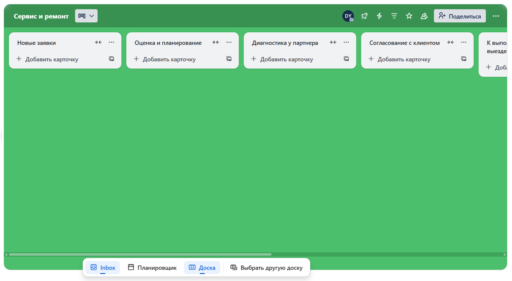
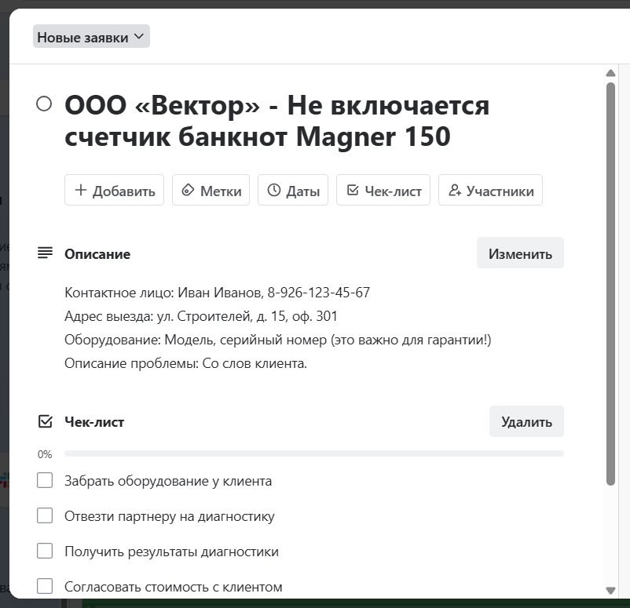

# От хаоса к контролю: как управлять выездным сервисом в Trello

## Часть 1. Вступление: когда рушатся идеальные планы

В выездном обслуживании техники много хаоса и неопределенности, но можно выделить два ключевых источника проблем.

Первый — сложный ремонт. Необходимо забрать оборудование, отвезти его к сервисному партнеру, дождаться результатов диагностики, согласовать стоимость с партнером и клиентом... Это долгий процесс, на любом из этапов которого легко потерять контроль.

Второй и самый непредсказуемый источник хаоса — внезапное расширение заказа. Инженер приезжает для обслуживания одного аппарата, а клиент просит посмотреть еще три. Отказываться — значит терять выгоду. В этот момент тщательно спланированная цепочка выездов на день рушится: появляется стресс, нужно срочно предупреждать следующих клиентов и никого не пропустить.

Напряжения добавляют срочные заказы «день в день» и гарантийные выезды, требующие первоочередного внимания. Часто клиенты, никак не связанные друг с другом, делают заказы одновременно. Все это превращает идеально спланированный график в гонку и становится серьезной проверкой для системы управления заявками.

Когда эти два потока — долгие сложные ремонты и непредсказуемые простые выезды — смешиваются в одной таблице или, что еще хуже, в голове одного человека, управлять ими становится практически невозможно.

В этой статье я покажу, как с помощью простого и бесплатного инструмента Trello создать единую, наглядную и гибкую систему отслеживания заказов. Она поможет вести задачи обоих типов и справляться с внезапным ростом объема работ. И самое главное — вы всегда будете знать статус любого заказа.

## Часть 2. Фундамент: проектируем единый путь для разных задач

Наша цель — создать единую доску, по которой будут двигаться карточки как простых, так и сложных заказов. Структура должна быть гибкой, чтобы учитывать и плановые, и внезапные задачи.

Наш реальный процесс строился так: заявки принимал диспетчер, а оценку, связь с клиентом и планирование вел инженер. Система в Trello будет отражать именно эту логику.

### Этапы работы (колонки на доске Trello)

*   **Новые заявки.** Сюда диспетчер заносит все входящие обращения. Это «буфер», который гарантирует, что ни один заказ не потеряется.
*   **Оценка и планирование.** Рабочая зона инженера. Он забирает заявку из «Новых», связывается с клиентом, квалифицирует задачу (простой выезд или сложный ремонт) и планирует свой график.
*   **Диагностика у партнера.** Колонка только для сложных заказов. Если инженер забрал оборудование, карточка находится здесь, пока партнер проводит диагностику.
*   **Согласование с клиентом.** Еще одна колонка для сложных случаев. Сюда карточка попадает после диагностики в ожидании подтверждения стоимости от клиента.
*   **К выполнению / На выезде.** Активная зона инженера на текущий день. Утром он перемещает сюда карточки выездов, запланированных на сегодня.
*   **Работы выполнены / Выставление счета.** Задача завершена. Для выездного обслуживания это сигнал к выставлению счета. Для сложного ремонта — оборудование готово к возврату и ожидает оплаты.
*   **Завершено.** Все работы выполнены, оборудование у клиента, документы подписаны, оплата получена. Полное закрытие заявки.

Эта система создает предсказуемость там, где, казалось бы, ее сложно достичь. Она не просто организует задачи, а наглядно отражает реальный рабочий процесс.

## Часть 3. Пошаговая инструкция: переносим систему в Trello

Мы спроектировали процесс, а теперь перенесем его в Trello. Это займет не больше 15 минут. Наша цель — не изучить все функции программы, а быстро собрать работающий инструмент.

### Шаг 1. Создаем доску

Доска — это наше рабочее пространство.

1.  Войдите в свой аккаунт Trello.
2.  В правом верхнем углу нажмите «Создать» → «Создать доску».
3.  Заголовок доски: Назовите ее просто и понятно, например, «Сервис и ремонт».
4.  Нажмите «Создать».

Готово. Перед вами — чистое цифровое пространство. Рекомендую сразу сменить фон на что-то нейтральное, чтобы он не отвлекал. Для этого нажмите на меню (три точки в правом верхнем углу) и выберите опцию смены фона.

### Шаг 2. Выстраиваем колонки — наш рабочий процесс

Теперь создадим колонки, которые повторяют наши этапы. Trello по умолчанию предлагает три списка: «Нужно сделать», «В процессе», «Готово». Мы их переименуем и добавим недостающие.

1.  Переименуйте существующие колонки, кликнув на каждый заголовок и вводя наши названия по порядку:
    *   `Нужно сделать` → **Новые заявки**
    *   `В процессе` → **Оценка и планирование**
    *   `Готово` → **Диагностика у партнера**
2.  Добавьте остальные колонки: справа от последнего списка нажмите «+ Добавьте еще одну колонку» и последовательно введите названия, каждый раз нажимая «Добавить список»:
    *   **Согласование с клиентом**
    *   **К выполнению / На выезде**
    *   **Работы выполнены / Выставление счета**
    *   **Завершено**

*Рис. 1 Общий вид пустой доски со всеми 7 колонками от «Новые заявки» до «Завершено».*

### Шаг 3. Проектируем карточку заказа

Настоящая сила системы — в информации, которая содержится в каждой карточке. Чтобы избежать хаоса, создадим единый стандарт. Нажмите «+ Добавить карточку» в колонке «Новые заявки».

**А. Название карточки:** краткое и информативное.

*   **Формат:** `[Название клиента] - [Суть проблемы/тип оборудования]`
*   **Пример:** `ООО «Вектор» - Не включается счетчик банкнот Magner 150`

**Б. Описание:** «тело» заказа, которое начинает заполнять диспетчер, а инженер — дополняет. Чтобы каждый раз не вводить эти поля вручную, рекомендуется создать **шаблон карточки**.

**Эту информацию собирает диспетчер во время первого звонка:**
*   **Контактное лицо:**
*   **Адрес выезда:**
*   **Оборудование:**
*   **Описание проблемы:**

**Эти элементы добавляет инженер на этапе «Оценки и планирования»:**
*   **Назначение участником:** Первым делом инженер **назначает себя участником** карточки, чтобы закрепить задачу за собой.
*   **Чек-лист (для сложных заказов):** Если ремонт будет долгим, инженер добавляет в карточку чек-лист с конкретными шагами. Это идеальный инструмент для отслеживания подзадач:
    *   [ ] Забрать оборудование у клиента
    *   [ ] Отвезти партнеру на диагностику
    *   [ ] Получить результаты диагностики
    *   [ ] Согласовать стоимость с клиентом
    *   [ ] Сообщить клиенту о готовности
*   **Срок:** После согласования даты выезда инженер устанавливает ее в карточке.

*Рис. 2 Крупный план открытой карточки Trello с названием, описанием и чек-листом.*

В результате мы получаем не просто доску, а полноценную систему контроля. Каждый новый заказ, созданный по этому шаблону, будет содержать всю необходимую информацию, а его путь по колонкам будет наглядным и предсказуемым.

## Часть 4. Система в работе: как это использовать каждый день

Мы собрали нашу доску — это основа системы. Но настоящая ценность проявляется в ежедневном использовании. Доска — это не просто список задач, а реальная живая карта вашего рабочего процесса. Давайте посмотрим, как она помогает справляться и с рутинными, и с непредсказуемыми задачами, превращая хаос в структурированный и управляемый поток.

### Сценарий 1: Путь простой заявки (от звонка до счета)

1.  **Поступление заказа.** Диспетчер получает звонок и сразу создает карточку в колонке «Новые заявки».
2.  **Планирование.** Инженер забирает карточку в «Оценку и планирование» и первым делом **назначает себя участником**, показывая, что задача в работе. После звонка клиенту он, часто прямо со смартфона, устанавливает согласованную **дату выезда через функцию «Сроки»**.
3.  **День выезда.** Утром инженер заходит в Trello, смотрит на карточки, у которых «Срок» наступает сегодня, и **переносит именно их** в колонку «К выполнению / На выезде». Это его четкий план на день.
4.  **Завершение.** Работа выполнена, акт подписан. Инженер перемещает карточку в «Работы выполнены / Выставление счета».
5.  **Архивация.** Счет оплачен. Карточка отправляется в «Завершено».

**Итог:** заказ проходит по доске как по конвейеру — линейно, плавно и без задержек.

### Сценарий 2: Путь сложного ремонта (контроль над долгими задачами)

Именно здесь система показывает свою главную особенность — умение удерживать в поле зрения задачи, которые растянуты во времени.

1.  **Начало.** Первые шаги те же: карточка из «Новых заявок» переходит в «Оценку и планирование». Инженер определяет, что необходим сложный ремонт, и забирает оборудование.
2.  **Передача партнеру.** Оборудование доставлено к сервисному партнеру. Инженер перемещает карточку в колонку «Диагностика у партнера». Это «зал ожидания» для сложных случаев.
3.  **Согласование.** Партнер сообщает результаты диагностики и стоимость. Карточка переводится в «Согласование с клиентом». Еще один «зал ожидания».
4.  **Завершение.** Клиент дает согласие. Карточка идет по знакомому маршруту: в «Работы выполнены / Выставление счета» и, наконец, в «Завершено».

**Итог:** специальные колонки-накопители делают долгий процесс на 100% прозрачным. Мы всегда знаем, на чьей стороне инициатива — у партнера или у клиента — и что нужно сделать, чтобы продвинуть заказ к следующему этапу.

### Сценарий 3: Стресс-тест (реакция на неопределенность)

**Ситуация А: «Посмотрите, пожалуйста, еще пару аппаратов».** Раньше это было головной болью: нужно было запомнить, записать на клочке бумаги, не забыть включить в счет.

*   **Решение в Trello:** Инженер открывает доску на смартфоне и за 30 секунд создает новую карточку прямо в колонке «К выполнению / На выезде».

**Ситуация Б: Срочный вызов от VIP-клиента.**

*   **Решение в Trello:** Диспетчер создает карточку. Инженер видит ее на доске, визуально оценивает свою загрузку и принимает взвешенное решение.

## Часть 5. Что это дало на практике? Результаты и преимущества

1.  **100% фиксация заказов.** Мы полностью исключили потерю заявок.
2.  **Радикальное сокращение времени на поиск информации.** Ответ на вопрос о статусе заказа теперь занимал 10 секунд.
3.  **Полная прозрачность длительных ремонтов.** Колонки «Диагностика у партнера» и «Согласование с клиентом» убрали «серые зоны».
4.  **Гибкое управление рабочим днем инженера.** Система дала инженеру инструмент для осознанных решений.
5.  **Наглядный контроль для руководителя.** Доска стала единым командным центром.

В итоге мы перешли от модели экстренного реагирования к четкому и опережающему управлению рабочим процессом.

## Часть 6. А что дальше? Как масштабировать систему

Эта система идеально подходит для небольшой команды. Но что, если у вас 5, 10 или 20 инженеров? Доска не утонет в хаосе, если использовать три встроенные функции Trello:

*   **Назначение участников:** За каждой задачей закрепляется ответственный инженер, и его аватар появляется на карточке.
*   **Цветные метки:** Для быстрой визуальной оценки приоритета и типа заказа («Срочно», «Гарантия», «VIP-клиент»).
*   **Фильтры:** Каждый инженер может в один клик (или нажатием клавиши Q) скрыть все чужие задачи и видеть только свою зону ответственности.

Таким образом, система гибко растет вместе с командой, сохраняя порядок и прозрачность.

## Часть 7. Заключение: главный вывод

Мы начали с проблемы двух хаотичных потоков. Мы не стали внедрять дорогостоящую CRM-систему. Вместо этого мы спроектировали логику нашего реального процесса и перенесли ее на простой и наглядный инструмент. Сила этой системы — в том, что она является точным визуальным отражением нашего рабочего процесса.

Этот кейс иллюстрирует ключевой управленческий принцип: **продуманный процесс всегда важнее самого дорогого ПО.**

Контроль, гибкость и предсказуемость рождаются не из технологической сложности, а из ясной логики, воплощенной в простом и доступном инструменте. Мы получили систему, которая дает команде возможность управлять хаосом, а не просто реагировать на него.