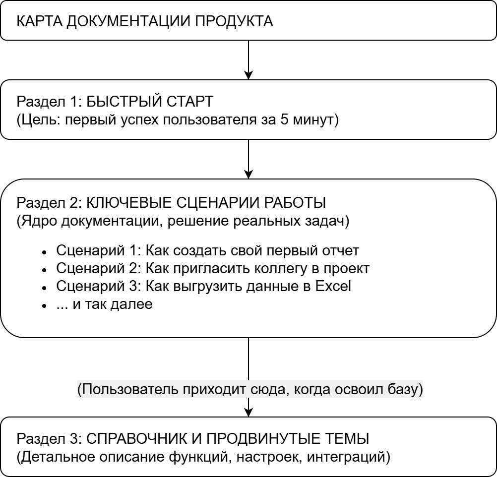

# Мой подход к работе с документацией: от хаоса к системе

За 20 лет работы с сервисной и пользовательской документацией я убедился в одной закономерности: лучшая техподдержка — та, в которую клиенту приходится обращаться как можно реже. Моя главная задача в документации — работать на опережение: не просто описывать функции продукта, а предвидеть и предотвращать проблемы пользователя.

И с сервисной документацией для инженеров, и с инструкциями для клиентов я видел одну и ту же проблему: они описывали функционал, но не путь пользователя к решению его актуальной задачи. Мне на практике приходилось создавать собственные — краткие и живые — инструкции, сфокусированные на реальных сценариях работы. Результат такого подхода был четко измерим: количество обращений в поддержку и гарантийных запросов снизилось, а удовлетворенность клиентов выросла.

Так я убедился, что качественная и актуальная документация — это прямой путь к экономии ресурсов компании и лояльности пользователей. Мой опыт доказал: базовые принципы и страхи пользователя при взаимодействии с чем-то новым универсальны. Неважно, что перед ним — программно-аппаратный комплекс или новый онлайн-сервис.

## Шаг 1. Стать новым пользователем и пройти его путь

Мой первый шаг с любым продуктом — поставить себя на место клиента. Применяя этот подход к цифровому продукту, я бы запросил доступ в новый аккаунт и поставил себе простую, но ключевую задачу.

Главное правило на этом этапе — использовать только существующую документацию, без подсказок и советов экспертов. Я бы внимательно фиксировал каждый момент, когда пришлось догадываться, каждый неясный термин и каждый вопрос, оставшийся без ответа.

**Результат этого шага** — не список опечаток, а потенциальные обращения в техподдержку. Каждый пункт в этом списке — это проблема, которую можно «обезвредить» еще до того, как с ней столкнется реальный пользователь.

## Шаг 2. Обратиться к экспертам за ответами

Список проблем, составленный на первом шаге, — это полезный документ, но он основан на беглом взгляде снаружи. Это предварительная гипотеза о том, где пользователь может испытывать затруднения. Чтобы превратить эту гипотезу в рабочий план, мне нужно детально понять внутреннее устройство и логику продукта.

### Первый визит — в техподдержку

Первым делом я бы обратился в техподдержку — это бесценный источник информации о реальных проблемах клиентов. Я бы уточнил у команды поддержки:

* С какими проблемами пользователи обращаются чаще всего?
* Какие, на первый взгляд, простые вещи вызывают больше всего сложностей?
* Какими лайфхаками и неписаными правилами команда делится с клиентами?

Общение с поддержкой позволило бы мне дополнить мой первоначальный список проблем и понять, на каком языке лучше говорить с пользователем.

### Второй визит — к разработчикам и продакт-менеджерам

Далее я бы обратился к разработчикам и продакт-менеджерам. Техподдержка описывает реальный опыт клиентов, но важно понять и первоначальный замысел: почему продукт спроектирован именно так?

Мои основные вопросы:

* Почему функции реализованы именно таким способом, какие сценарии при этом закладывались?
* Какие есть неочевидные ограничения и «подводные камни», о которых нужно предупредить пользователя заранее?
* Какая концепция вызвала наибольшие сложности при обсуждении в команде еще на этапе создания продукта?

В результате у меня на руках оказался бы список проблем, проверенный как на уровне экспертов, так и на основе отзывов реальных пользователей.

## Шаг 3. Создать карту документации: от хаоса к структуре

На этом этапе у меня есть богатый материал. Начинать писать отдельные статьи сейчас — преждевременно. Этот путь привел бы к созданию хаотичного сборника разрозненных инструкций.

Вместо этого я создаю карту, которая проведет пользователя от первой встречи с продуктом до этапа уверенного использования. В основу архитектуры я закладываю два принципа.

1. **Отталкиваться от задач пользователя, а не от функций продукта.**
    Пользователя интересует решение его проблемы, а не изучение функционала. Мой фокус — не на описании настроек, а на ответах на вопрос «Как мне решить свою задачу?».

2. **Провести пользователя от простого к сложному.**
    Чтобы не перегружать пользователя, я выстраиваю путь с постепенным повышением сложности. Стандартный алгоритм адаптации включает в себя несколько разделов:
    * **Раздел 1: «Быстрый старт».** Задача — провести пользователя к первому успешному опыту.
    * **Раздел 2: «Основные сценарии работы».** Ядро документации. Здесь собраны решения для большинства ключевых задач.
    * **Раздел 3: «Справочник и продвинутые сценарии».** Описание каждой функции, всех настроек и решений редких проблем.

Эту структуру я всегда визуализирую в виде блок-схемы.

{width="70%"}

*Рис.1 Карта документации, ведущая пользователя от простого к сложному*

**Результат этого шага** — утвержденный план всей базы знаний.

## Шаг 4. Написать текст: просто, понятно, по делу

Архитектура — это основа. Теперь моя задача — создать контент. Для меня текст в документации — это не литература, а инструмент, помогающий пользователю быстро и качественно выполнить свою работу.

### 1. Говорить на языке пользователя

Я всегда стараюсь заменить сложный технический термин на простое описание. В моей прошлой работе клиентов ставила в тупик настройка «оптической плотности» в счетчиках банкнот. Вместо объяснения физики процесса я давал простую инструкцию: «Представьте, что аппарат смотрит каждую банкноту на просвет. Если банкноты ветхие и грязные, они пропускают меньше света. Этой настройкой мы и выбираем уровень „чистоты“ банкнот, который считаем нормальным. Поэтому для новых и для изношенных купюр он разный».

### 2. Объяснять сложное через простые аналогии

Действенный способ снять страх перед сложной системой — найти для нее жизненную аналогию. Клиентов раздражало, когда детектор валют отбраковывал настоящую, но потертую купюру. Я объяснял это так: «Ваш детектор — как очень ответственный кассир. У него строгая инструкция: при малейшем сомнении — отложить купюру. Он лучше 10 раз перестрахуется на настоящей, чем один раз пропустит подделку».

### 3. Форматировать текст для быстрого сканирования

Документацию редко читают от корки до корки — ее «сканируют» в поисках ответа. Поэтому я проектирую текст так, чтобы его было удобно читать:

* **Короткие абзацы:** одна мысль на абзац.
* **Списки** для всего, что можно перечислить.
* **Выделение жирным** ключевых терминов, названий кнопок и важных предупреждений.
* **Простые схемы** вместо скриншотов там, где важна логика, а не текущий интерфейс.

**Результат этого шага** — текст, который экономит время пользователя и дает ему ощущение контроля.

## Шаг 5. Оценить эффективность документации

Работа технического писателя не заканчивается публикацией. Документация бесполезна, если ее не читают или она не решает проблем. Поэтому мой финальный шаг — оценка эффективности.

Мои критерии успешной документации:

* **Снижение обращений в техподдержку.** Это главный показатель. Его можно отследить, оценивая количество тикетов по темам, которые мы описали.
* **Прямая обратная связь от пользователей.** Простой виджет «Была ли эта статья полезной?» в конце каждой страницы дает ценную информацию.
* **Обратная связь от команды поддержки.** Я бы регулярно уточнял у коллег, помогает ли им новая документация в работе с клиентами.

Документация должна быть таким же живым и адаптирующимся организмом, как и сам продукт.

## Заключение

Эти пять шагов — не просто создание технического текста. Это реализация главного принципа: **работать на опережение.** Моя цель — создать у пользователя чувство уверенности в своих силах и плавно провести его по всем аспектам продукта. Я знаю по опыту, что даже гениальный продукт может быть отторгнут из-за неудачной инструкции.

В конечном счете, документация превращается из статьи расходов в инструмент, который снижает издержки бизнеса и повышает лояльность клиентов.
